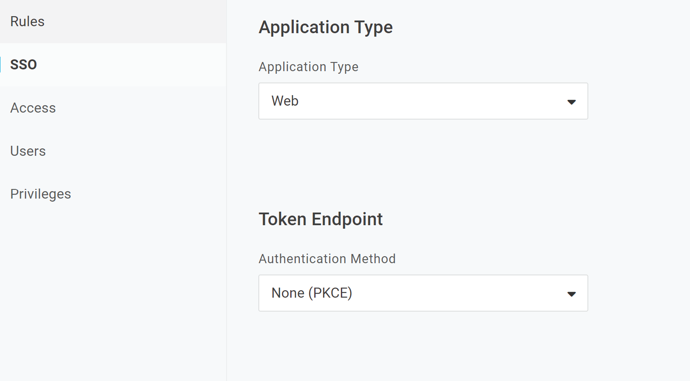

# Demo Onelogin PKCE demo

This is demo react app to demo OneLogin PKCE flow

# Setup and execution

1. Configure PKCE authentication in OneLogin for the application:

!

2. Change the configuration in OneLoginSecuredWrapper.tsx file
  Lines: 10, 11, 12, and 16

3. yarn install and yarn start  

